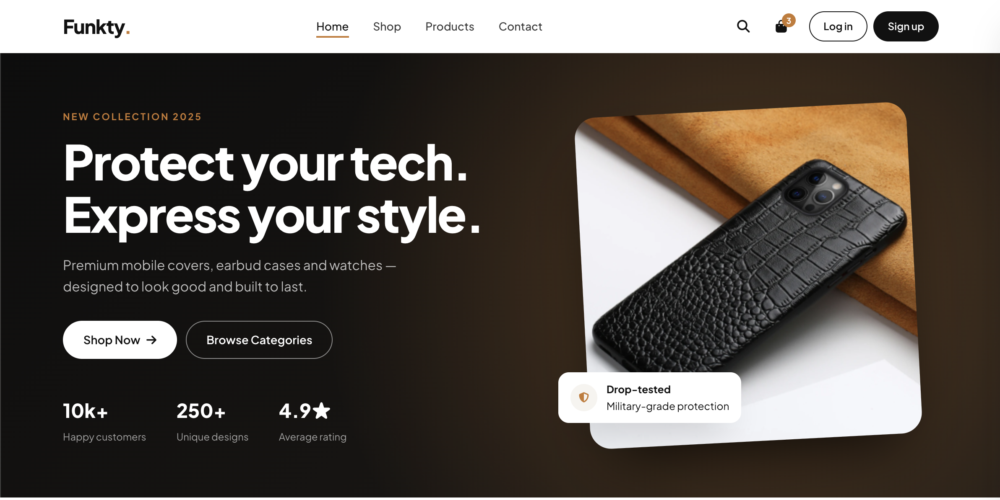
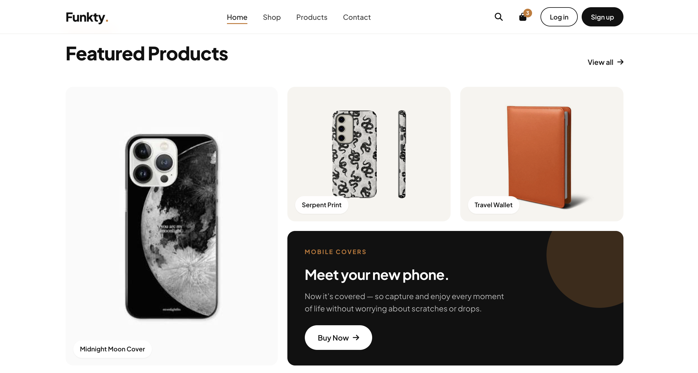
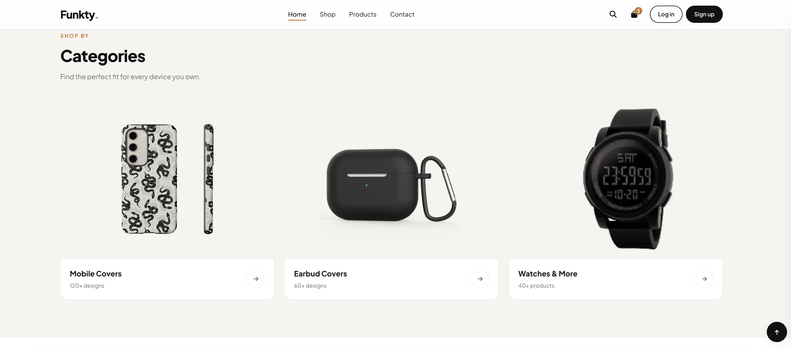
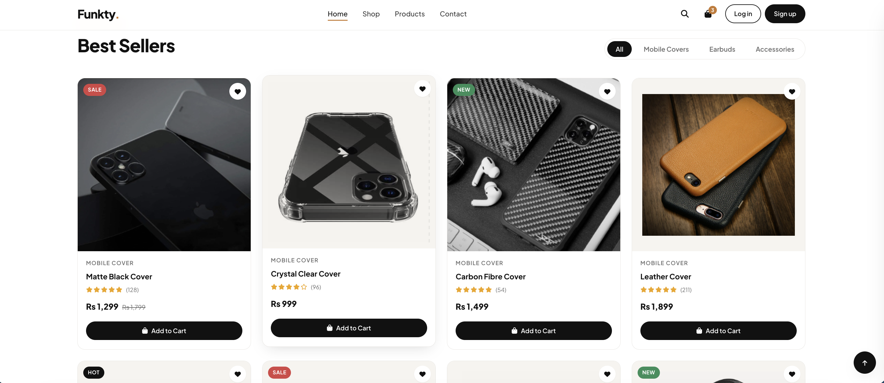
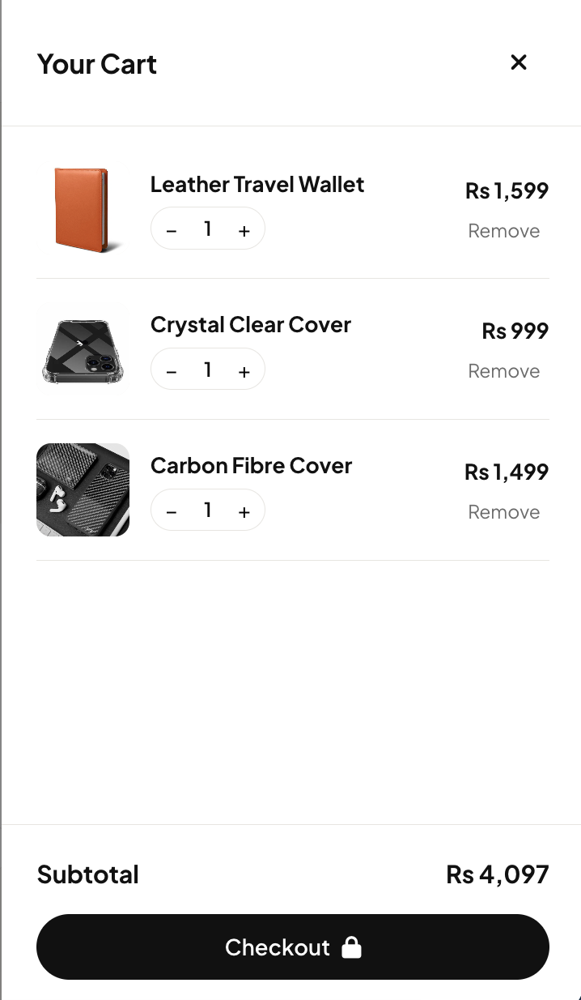
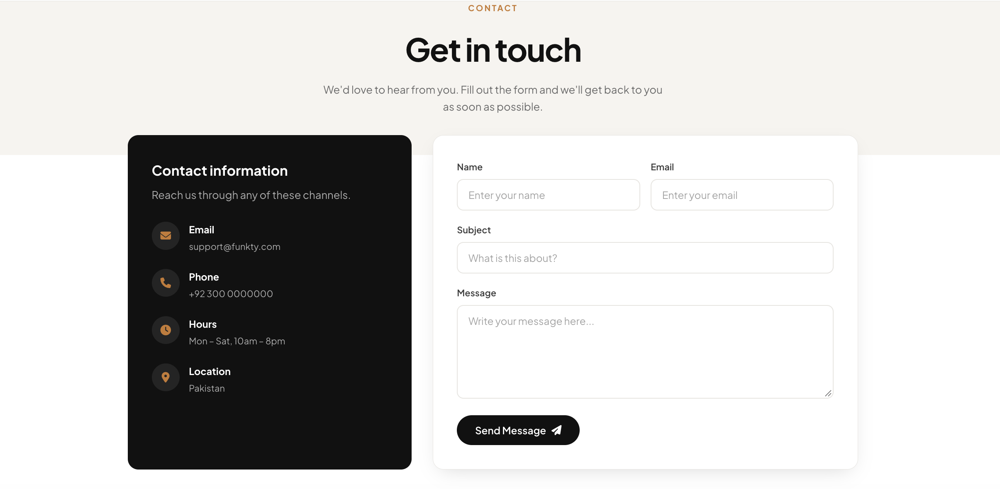
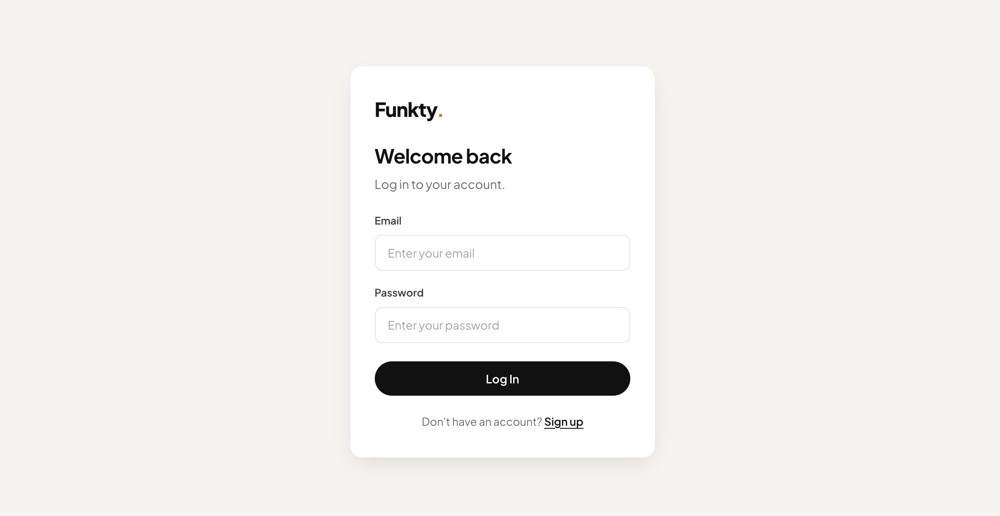
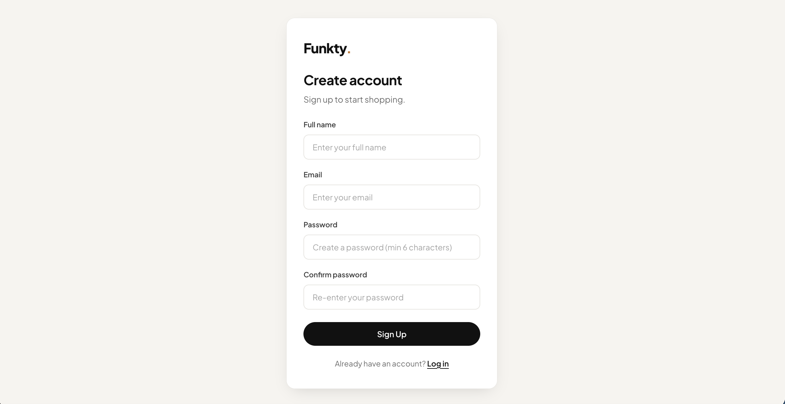

# Funkty — E-Commerce Website

Funkty is a responsive e-commerce front-end for mobile covers, earbud cases and watches. It is built with plain **HTML, CSS and JavaScript** — no frameworks and no build step.

---

## 📸 Screenshots

<table width="100%">
  <tr>
    <td width="50%" align="center"><b>Home — Hero</b></td>
    <td width="50%" align="center"><b>Featured Products</b></td>
  </tr>
  <tr>
    <td width="50%" align="center"></td>
    <td width="50%" align="center"></td>
  </tr>
  <tr>
    <td width="50%" align="center"><b>Categories</b></td>
    <td width="50%" align="center"><b>Best Sellers</b></td>
  </tr>
  <tr>
    <td width="50%" align="center"></td>
    <td width="50%" align="center"></td>
  </tr>
  <tr>
    <td width="50%" align="center"><b>Cart</b></td>
    <td width="50%" align="center"><b>Contact Page</b></td>
  </tr>
  <tr>
    <td width="50%" align="center"></td>
    <td width="50%" align="center"></td>
  </tr>
  <tr>
    <td width="50%" align="center"><b>Login</b></td>
    <td width="50%" align="center"><b>Sign Up</b></td>
  </tr>
  <tr>
    <td width="50%" align="center"></td>
    <td width="50%" align="center"></td>
  </tr>
</table>

---

## ✨ Features

- **Responsive design** that works on desktop, tablet and mobile
- **Hero section** with call-to-action buttons and store stats
- **Featured products** shown in a bento-style grid
- **Category cards** that filter the product list when clicked
- **Product cards** with badges, wishlist button, ratings, prices and Add to Cart
- **Category tabs** for filtering: All, Mobile Covers, Earbuds, Accessories
- **Cart drawer** with quantity controls, item removal and subtotal; the cart is saved in `localStorage`
- **Sign up and login** pages with simple validation (demo only)
- **Session-aware navbar** that shows the user's name and a Log out button after login
- **Contact page** with a contact form and store details
- Newsletter form, toast notifications and a back-to-top button

---

## 🗂️ Project Structure

```
Funkty-ECommerce-Site/
├── home.html        # Main store page
├── login.html       # Login page
├── signup.html      # Sign up page
├── contact.html     # Contact page
├── style.css        # Shared styles for all pages
├── main.js          # Shared JS (cart, menu, toast, session)
├── assets/          # Product images and icons
└── screenshots/     # Images used in this README
```

---

## 🚀 Getting Started

1. Clone the repository:
   ```bash
   git clone https://github.com/AmeerDawood/Funkty-ECommerce-Site.git
   cd Funkty-ECommerce-Site
   ```
2. Open `home.html` in your browser. You can also use a local server, such as the VS Code **Live Server** extension.

### Demo login

| Email              | Password |
| ------------------ | -------- |
| `admin@funkty.com` | `1234`   |

You can also create a new account on the **Sign Up** page.

> ⚠️ **Note:** Authentication is for demo purposes only. Accounts are stored in the browser's `localStorage`. A real backend is needed before using this in production.

---

## 🛠️ Customising Products

Products are defined in an array near the bottom of `home.html`:

```js
{ id: "p1", name: "Matte Black Cover", cat: "covers", label: "Mobile Cover",
  price: 1299, old: 1799, img: "assets/phone4.png", badge: "sale", rating: 5, reviews: 128 }
```

- `cat` — `covers`, `earbuds` or `accessories` (used by the filter tabs)
- `old` — optional original price, shown with a line through it
- `badge` — optional: `sale`, `new` or `hot`
- `contain: true` — use this for product photos that have a white background

---

## 🧰 Tech Stack

- HTML5
- CSS3 (custom properties, Grid, Flexbox)
- Vanilla JavaScript
- [Font Awesome](https://fontawesome.com/) icons
- [Plus Jakarta Sans](https://fonts.google.com/specimen/Plus+Jakarta+Sans) font

---

## 📄 License

&copy; 2025 Funkty. All rights reserved.
